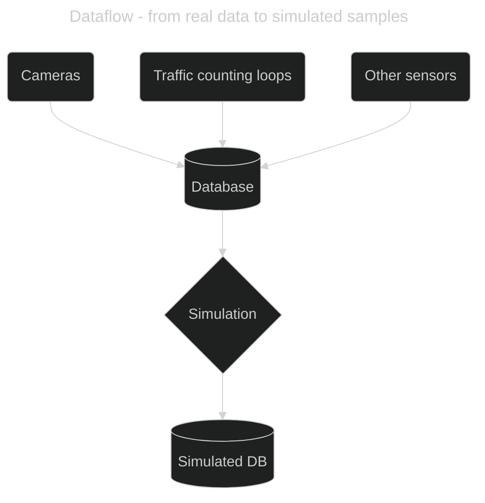

# Python Code

The Python code focus mainly on reading information taken from sensors (mainly city cameras and [traffic counting loops](https://diamondtraffic.com/))

```mermaid

---
title: Dataflow - from real data to simulated samples
---

%%{init: { 'logLevel': 'debug', 'theme': 'dark' } }%%

graph TD
  cameras(Cameras) --> db[(Database)]
  tcl(Traffic counting loops) --> db
  etc(Other sensors) --> db
  db --> sim{Simulation}
  sim --> simdb[(Simulated DB)]

```
